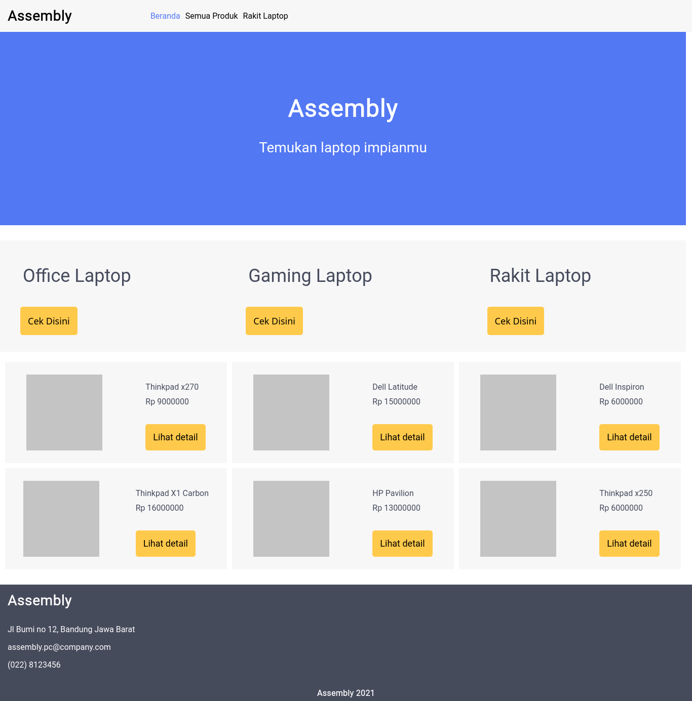

# WPU Code Jam E Commerce
website jual dan rakit laptop Assembly.
live demo bisa dilihat pada [https://assemblytestalpha.com/](https://assemblytestalpha.com/)

## Daftar isi
- [requirements](##Requirements)
- [instalasi](##instalasi)
- [screenshot](##screenshot)

## Requirements
- PHP version >= 7.4
- composer version >= 2.0.11
- NodeJS version >= 12 (Optional)
- MySql version 8

## Instalasi
1. clone repository dan masuk ke folder repository
1. install depedency `composer install`
1. copy .env.example menjadi .env lalu isi berdasarkan koneksi database mysql
1. `php artisan key:generate`
1. `php artisan serve`

## Screenshot

